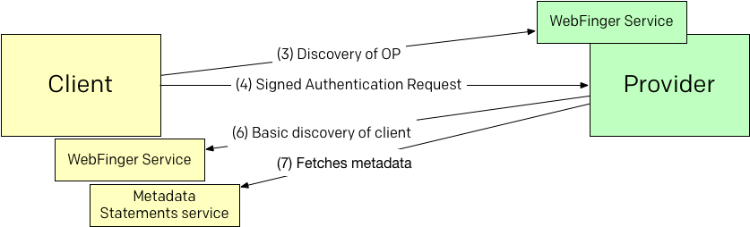

[Here is a draft of this specification](https://oauth.no/openid-connect-federation-async-00.html)


# OpenID Connect Federation

This is a draft note describing an alternative approach to parts of the [OpenID Connect Federation spec](http://openid.net/specs/openid-connect-federation-1_0.html). Here are some highlights:

* Enforces use of asymmetric crypto for clients
* Allows use of out of regular OpenID Connect without specific support for «Federation»
* No use of the OpenID Connect Dynamic Registration
* Reduces the amount of state necessary to be kept both in clients and providers.





## 1. Client configures a key pair to use with OpenID Connect

The client generates a key pair. The public key may look like this:

```
{
  "kty": "RSA",
  "kid": "https://serviceprovider.org/application#1",
  "n": "l7rt1yRvbiOKg8XeP_ICo0yDif-kOLWkUL5FAWKVWhWWAdnN2o1t_otuBX1xLeItE24he4qGHBzh2PQ4SRqau6ZVzx4-aJFzGZSbw6SswVXPlFR5dRkJMn4wxFOOVsSUnltO4K27X2Pf-gwlLFdH4q4QTNU5U8ijr76BnuUThdBYrxf2UQT7DDz6cPHaRdOUbuj_Ids9CmV6HyzdIFOfBx7DKS8o2fqH9Fa6-PKdMtDJiZ1KfjgstiNB04JAbQ1RI9Bl-No6NTUcZbD7Q0JF8iqY3Hogo9J_mL-SgQFGgwAoxQKoNeLk7uLHc69yIlyBJegrVkmHUKehIp3OZ5CW9w",
  "e": "AQAB"
}
```

## 2. Client chooses a `client_id`

The client will choose a `client_id` that includes the hostname of the client application. The hostname used in the client_id will be used for discovery by the OpenID Connect Provider.

In example the client can use this `client_id`:

* `https://serviceprovider.org/application`


## 3. User and client discovers the OpenID Connect Provider

Using some kind of discovery process the client selects an OpenID Connect Provider aided by the end-user.

Discovery process is specified [in OpenID Connect Core](http://openid.net/specs/openid-connect-core-1_0.html).

Including Provider Metadata statement in the discovery response as described [in OpenID Connect Federation](http://openid.net/specs/openid-connect-federation-1_0.html).


## 4. Client sends an authentication request


```
GET /authorize?request=eyJhbGciOiJSUzI1NiIsImtpZCI6ImsyYmRjIn0.ew0KICJpc3Mi...
  &response_type=code
  &client_id=https%3A%2F%2Fserviceprovider.org%2Fapplication
  &redirect_uri=https%3A%2F%serviceprovider.org/application%2Fcallback HTTP/1.1
Host: provider.org
```

The client MUST send a [signed authentication request as described in *OpenID Connect Core section 6*](http://openid.net/specs/openid-connect-core-1_0.html#JWTRequests). It MUST sign the request using the same key as described in section 1 in this document.


## 5. Provider receives the authentication request

If the provider has no preconfigured trust with the incoming request `client_id`, and if the `client_id` is a valid URL, and if the provider support OpenID Connect Federation it will proceed with discovery of the client.

## 6. Provider performs discovery of the client


OpenID Connect Federation uses the following discoverable `rel` value in [WebFinger [RFC7033]](https://tools.ietf.org/html/rfc7033):

* `http://openid.net/specs/connect/1.0/provider`

The provider performs normalization rules to the `client_id` to determine the hostname. The client_id URL will be the `resource`.

In example the `client_id` `https://serviceprovider.org/application` may result in the following WebFinger request:

```
GET /.well-known/webfinger?
  resource=https%3A%2F%2Fserviceprovider.org%2Fapplication&
  rel=http%3A%2F%2Fopenid.net%2Fspecs%2Fconnect%2F1.0%2Fprovider
  HTTP/1.1
Host: example.com
```

The response may include a link for every federation root that has a metadata statement about the client. Each link SHOULD include a property that identifies the trust root of this federation. This aids the provider to fetch and process only relevant metadata. The property `http://openid.net/specs/connect/1.0/federation` is reserved for this purpose.


```
HTTP/1.1 200 OK
Access-Control-Allow-Origin: *
Content-Type: application/jrd+json

{
  "subject" : "https://serviceprovider.org/application",
  "links" :
  [
    {
      "rel" : "http://openid.net/specs/connect/1.0/provider",
      "href" : "https://metadata.feide.no/237645",
      "properties": {
        "http://openid.net/specs/connect/1.0/federation": "https://feide.no"
      }
    },
    {
      "rel" : "http://openid.net/specs/connect/1.0/provider",
      "href" : "https://mds.edugain/openid/238476238764",
      "properties": {
        "http://openid.net/specs/connect/1.0/federation": "https://edugain.org"
      }
    },
    {
      "rel" : "http://openid.net/specs/connect/1.0/provider",
      "href" : "https://openid.clarin.org/entries/123",
      "properties": {
        "http://openid.net/specs/connect/1.0/federation": "https://clarin.org"
      }
    }
  ]
}
```

The metadata document MAY be hosted by the client it self or by the federation provider registry or anywhere else.


## 7. Provider fetches and process metadata

In order to establish trust with the client, the provider may fetch all the relevant metadata documents using the links from the discovery described above.

Fetching a metadata is as simple as a GET on the link.

The response will be a signed JSON Web Token with MIME type `application/jwt`. No plain text metadata is allowed.

Nested signed metadata statements are described [in OpenID Connect Federation](http://openid.net/specs/openid-connect-federation-1_0.html).


## 8. Provider redirects user back to client

No specific changes in this part. The trusted `redirect_uri` included in the request and defined in the Metadata Statement is used.

## 9. Client sends authenticated request to the token endpoint

In the authorization code flow, the client uses the token endpoint to obtain the OAuth Access Token and the OIDC ID Token.

The client MUST authenticate the request towards the OP, but does not have any client_secret. Instead the client MUST authenticate the request using the key pair described in section 1. The client MUST authenticate the request by including the `private_key_jwt` parameter described in [OpenID Connect Core Section 9](http://openid.net/specs/openid-connect-core-1_0.html#ClientAuthentication).

The `aud` parameter of the generated JWT MUST equal the OP `issuer`.


Here is an example:

```
POST /token HTTP/1.1
Host: server.example.com
Content-Type: application/x-www-form-urlencoded

grant_type=authorization_code&
  code=791222e0-bd67-40f9-8c41-4dd65a9ea33d&
  client_id=https%3A%2F%2Fserviceprovider.org%2Fapplication&
  client_assertion_type=
  urn%3Aietf%3Aparams%3Aoauth%3Aclient-assertion-type%3Ajwt-bearer&
  client_assertion=PHNhbWxwOl ... ZT
```


## Metadata Statements issued about clients


Metadata statements MUST include:

* `client_id`
* `redirect_uri`
* `scopes`
* Somehow the client MUST indicate whether or not it will be allowed to send unsigned authentication requests.


Metadata statements SHOULD include:

* ``


## Metadata Statements issued about clients

Metadata statements MUST include:

* `issuer`

Metadata statements SHOULD include:

* ``
